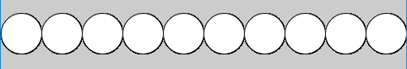
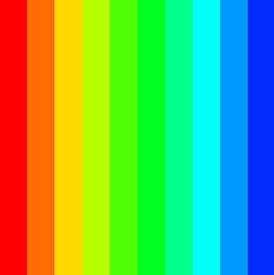

# Game Programming 2022-2023

[](https://www.youtube.com/watch?v=xF7VrXZqLko)

<!--
## Teams Links
- [Thursday class](https://teams.microsoft.com/l/meetup-join/19%3ameeting_NmE3NTgzMmEtNmE3Ny00M2RkLWFjYTctM2Y0ZjNjYTE0NDdm%40thread.v2/0?context=%7b%22Tid%22%3a%22766317cb-e948-4e5f-8cec-dabc8e2fd5da%22%2c%22Oid%22%3a%2261aab78b-a857-4647-9668-83d4cca5de03%22%7d)
- [Thursday Lab](https://teams.microsoft.com/l/meetup-join/19%3ameeting_ZDU3NDA0NjMtMmI4Zi00MzhkLTgyMjctZmIxZGUxNGNjYzA3%40thread.v2/0?context=%7b%22Tid%22%3a%22766317cb-e948-4e5f-8cec-dabc8e2fd5da%22%2c%22Oid%22%3a%2261aab78b-a857-4647-9668-83d4cca5de03%22%7d)
-->

Resources
---------
* [Processing](http://processing.org)
* [Processing reference](https://processing.org/reference/)
* [The Coding Train](https://www.youtube.com/channel/UCvjgXvBlbQiydffZU7m1_aw)
* [The Nature of Code](http://natureofcode.com/)
* [Games Fleadh](http://www.gamesfleadh.ie/)

## Past Exams
- [End of year Lab test 2020](https://github.com/skooter500/GP-2020-2021)
- [End of year Lab Test 2019](https://github.com/skooter500/GP-LabTest2-2019)
- [Supplemental Lab Test 2019](https://github.com/skooter500/gp2019-august-lab-test)
- [Supplemental Lab Test 2018](https://github.com/skooter500/GP-Autumn-Lab-Test-2018)
- [Lab Test 1 2016](https://github.com/skooter500/GP_Lab_Test_1)
- [Supplemental lab test 2 2016](https://github.com/skooter500/DT508-Lab-Test-Supplemental-2016)
- [End of year lab test 2016 Solution](https://github.com/skooter500/DT508-Lab-Test-Solution-2016)
- [Lab Test 1 2015](https://github.com/skooter500/dt508_2015_labtest1)

## Contact the lecturer
* Email: bryan.duggan@tudublin.ie
* [My website & other ways to contact me](http://bryanduggan.org)

## Assignments

- December - Assignment 1 submission 15%
- December Lab Test 25%
- Assignment 2 31st January 15%
- Assignment 3 20% 
- End of Year lab test - TBC 25%

## Week 7 - More Loops

### Put these loops into the setup method:

- Print the numbers from 0 to 9. How many numbers are printed?
- Print the numbers from 9 to 0 in reverse order
- Print all the even numbers between 100 and 200
- Sum all the numbers between 0 and 100
- Calculate the factorial of 10
- Print the even numbers between 200 and 100 backwords
- Print the 6 times tables up to 12
- Print the Fibonacci sequence up to 100

### Put these loops into the draw method:

- Draw 6 circles across the screen
- Draw 10 rects across the screen
- Draw 20 horizontal lines
- Draw a stripe pattern across the screen
- Draw a grid of squares

## Week 8 - Loops

- Practice generating lots of different shapes with loops in processing
- Be creative and make something beautiful in code

Draw the following shapes. Use variables and loops in your solutions!

I'ts best to spend some time thinking about the variables and how they are changing before writing code:

These require ONE loop:


This shape draws lines from the sides that all meet in the middle. This can be done using one loop, but is better with two:


This sketch always draws 10 equally sized circles across the screen. This should work no matter what you set the screen size to. You should also declare a variable to hold the number of circles to draw so that if you change this number, the sketch should still work:



This sketch places circles around the outside of a bigger circle to make a flower pattern. Once you figure this out, you can modify it to do something cool with colours:


This sketch prints the numbers of the clock around in a circle:


This sketch requires you to put one loop inside another and also use a boolean variable, though there are other ways to do this:


This is what it looks like when all the above code is in one sketch:


Try and draw this using ONE for loop:


Write a sketch that can draw regular polygons like squares, pentagons, octogons etc:


Write a sketch that can draw stars like these:


Use a for loop, rect and HSB colours to draw this:



Use sin and cos to draw this:


Use a loop and the HSB colour space:


Use ellipse to draw this:


Use a nested loop (a loop inside a loop) to draw this:


# Week 5 - BugZap!
- [Source code for BugZap](https://github.com/skooter500/BugZap/)
- [Moving letters library](https://drive.google.com/open?id=1zXtP8-P2-kE6aVsC2dTwhR2fooC60TfZ) - Install this into the ```Documents\Processing\libraries\movingletters\library``` folder on your computer

# Week 4 - Conditional

### Learning Outcomes
- Learn conditional syntaxes and operators: boolean expressions, relational operators, if-else statements, logical operators
- Use conditional programming in sketches

## Lab
[Conditional operations](https://docs.google.com/document/d/1eRqL4RBA9pwyj7L8jQEhiJVpbvoIfGiP/edit?usp=sharing&ouid=113463557400115436734&rtpof=true&sd=true)
- Task 1: Changing window colour
- Task 2: Moving a rectangle across window
- Task 3: A simple rollover
- Task 4: Fading colour
- Task 5: Moving a ball across window using Boolean variables
- Task 6: A bouncing ball (step-by-step addition conditions)

# Week 3 - Using variables and trigonometric functions
- [Trigonometry problem set](https://1.cdn.edl.io/IDqRlI8C9dRkoqehbbdHBrcGT6m87gkCQuMKTkp0U7JvHvuG.pdf)

## Lab
### Learning Outcomes
- Use numeric variables in a sketch
- Use operators on variables
- Use trigonometry
- Make beautiful things

A person flying a kite has released 176m of string. The string makes an angle of 27° with the ground. How high is the kite? How far away is the kite horizontally?

Write a processing sketch sketch to draw and solve the problem.
  - Solve the problem on paper first
  - Make variables for stringLen, theta, kHeight, kDist and any other variables you need
  - Assign the values that you know to the variables
  - Write code to calculate the kith height and horizontal distance values
  - Write code to draw the scenario


You can use the function [text](https://processing.org/reference/text_.html) to print text to the screen and [nf](https://processing.org/reference/nf_.html) to format a number to a certain number of dp's. For example ```text("Price: " + nf(p, 10, 2), 10, 50)```. You can look these functions up in the Processing reference.

### Part 2 - Spiral Jam

Experiment with the spirals sketch and see what kind of crazy beautiful spirals you can make. Use variables for colour gradients, use different shapes etc etc.

# Week 2 - Using variables
### Learning Outcomes
- Practice drawing
- Learn how to use operators with variables

# Part 1

Here is a youtube video of 4 sketches you can program today:

[](https://www.youtube.com/watch?v=kPOFqXsLLeo)

In your solution use the following processing functions:
- fill
- rect
- ellipse
- background
- stroke
- noStroke

And the mouseX and mouseY varibles. You can also use the + - * / operators

# Part 2

[](https://www.youtube.com/watch?v=uvPVGiU-bn4)

What is happening:

- The ground takes up half the window size
- The spaceship is 100 pixels wide and is *centered* around the mouse position.
- The person starts at the right side of the screen and moved from right to left

Use variables wherever practical in your sketch and calculate positions and sizes relative to these variables.

Bonus!

There are few things you can try (but you will probably have to read ahead and figure out how the if statement works)

- Come up with a more beautiful looking spaceship and person
- Change the colours of everything
- Make a car that drives from left to right
- When the person reaches the left side of the screen, he should switch direction
- Make the lights on the spaceship flash different colours

# Week 1

## Lecture
- [Introduction Slides](https://tudublin-my.sharepoint.com/:p:/g/personal/bryan_duggan_tudublin_ie/EV-PGwj9NsxNiG31kq8iOAMBUw4lhUTDxzStv0OKhWl6bA?e=uF9T0i)
- [eye sketch](sketches/eye.pde)

## Lab

### Learning Outcomes
- Know good online resources
- Check out previous student work
- Learn how to draw using Processing
- Become familiar with writing and running sketches

### Instructions
- Check out [the Processing reference](https://processing.org/reference/)
- Check out [The Coding Train](https://www.youtube.com/channel/UCvjgXvBlbQiydffZU7m1_aw)
- Check out [these Sci-Fi user interfaces made by last years OOP students](https://www.youtube.com/playlist?list=PL1n0B6z4e_E5RZYrubD2pcxq0qzGy-3vr)
- Check out [these music visualisers made in Processing by previous programming students](https://www.youtube.com/watch?v=NGQbYEESZEg&list=PL1n0B6z4e_E7I2bIWWpH8NAa6kPx95sw5)
- If you are curious, check out [some of my creature videos](https://www.youtube.com/watch?v=cW8s5i9dmqA&list=PL1n0B6z4e_E6jErrS0ScSCaVrN7KV729x)
- Look up the following methods in the Processing reference to make sure you are clear about the syntax and parameters:
    - noStroke
    - noFill
    - line
    - ellipse
    - rect
    - background
    - stroke
    - fill
    - size
    - arc
    - triangle

Write sketches to draw the following shapes:


