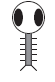

# Game Programming 2021-2022

[](https://www.youtube.com/watch?v=xF7VrXZqLko)

<!--
## Teams Links
- [Thursday class](https://teams.microsoft.com/l/meetup-join/19%3ameeting_NmE3NTgzMmEtNmE3Ny00M2RkLWFjYTctM2Y0ZjNjYTE0NDdm%40thread.v2/0?context=%7b%22Tid%22%3a%22766317cb-e948-4e5f-8cec-dabc8e2fd5da%22%2c%22Oid%22%3a%2261aab78b-a857-4647-9668-83d4cca5de03%22%7d)
- [Thursday Lab](https://teams.microsoft.com/l/meetup-join/19%3ameeting_ZDU3NDA0NjMtMmI4Zi00MzhkLTgyMjctZmIxZGUxNGNjYzA3%40thread.v2/0?context=%7b%22Tid%22%3a%22766317cb-e948-4e5f-8cec-dabc8e2fd5da%22%2c%22Oid%22%3a%2261aab78b-a857-4647-9668-83d4cca5de03%22%7d)
-->

Resources
---------
* [Processing](http://processing.org)
* [Processing reference](https://processing.org/reference/)
* [The Coding Train](https://www.youtube.com/channel/UCvjgXvBlbQiydffZU7m1_aw)
* [The Nature of Code](http://natureofcode.com/)
* [Games Fleadh](http://www.gamesfleadh.ie/)

## Past Exams
- [End of year Lab test 2020](https://github.com/skooter500/GP-2020-2021)
- [End of year Lab Test 2019](https://github.com/skooter500/GP-LabTest2-2019)
- [Supplemental Lab Test 2019](https://github.com/skooter500/gp2019-august-lab-test)
- [Supplemental Lab Test 2018](https://github.com/skooter500/GP-Autumn-Lab-Test-2018)
- [Lab Test 1 2016](https://github.com/skooter500/GP_Lab_Test_1)
- [Supplemental lab test 2 2016](https://github.com/skooter500/DT508-Lab-Test-Supplemental-2016)
- [End of year lab test 2016 Solution](https://github.com/skooter500/DT508-Lab-Test-Solution-2016)
- [Lab Test 1 2015](https://github.com/skooter500/dt508_2015_labtest1)

## Contact the lecturer
* Email: bryan.duggan@tudublin.ie
* [My website & other ways to contact me](http://bryanduggan.org)
* Email (Senja): anhduong.trinh@tudublin.ie

## Assignments

- Monday 6th December - Assignment 1 submission 15%
- Monday 13th - December Lab Test 25%
- Assignment 2 - 31st January 15%
- Assignment 3 - TBC 20% 
- End of Year lab test - TBC 25%

# Semester 2

## Week 6
## Lab
- [Worksheet](https://1drv.ms/w/s!Ak7y2552PWCrhft_--GKn97-v56DhA?e=X3AN9x)

Make this in Processing:

[](https://youtu.be/Nu1reFsEBrY)


## Week 1

### Lab

## Part 1
Try the lerping technique on the actual audio samples. To do this:
- Make an array of type float the same size as the audio buffer
- Lerp each element of the array to the corresponding buffer element
- Draw using the lerped values instead of the buffer values

## Part 2 
- Make this little ellipse whose size and speed of movement is controlled by how loud the sound it:

[](https://www.youtube.com/watch?v=5Twdbqxrpdg)

## Part 3
- See what other drawing elements - rectangles, triangles etc you can control using the average amplitude of the sound

Some audio responsive stuff I have been working on recently:

[](https://www.youtube.com/watch?v=4Fc_OW4M5AU)

[](https://www.youtube.com/watch?v=xF7VrXZqLko)

[](https://www.youtube.com/watch?v=KNymjRyr27A)


# Week 8 - Lab Test 1
[Link to Lab Test 1](https://github.com/skooter500/GP-2021-2022/blob/master/Lab_Test_1.md)


# Week 7 - Functions

### Learning Outcomes

Learning to define and use *Functions* in Processing
- Concept of functions in Programming
- Defining a function
- Arguments of a function
- Type of a function

## Lab - The Game of Life

Write the method ```updateBoard```. This method should iterate over the board cell by cell using a nested for loop and apply the Game of Life rules:

1. If the cell is alive (true) then if the cell has exactly 2 or 3 neighbours it survives (gets set to true), otherwise it dies (gets set to false)
2. If the cell is dead (false) then it comes to life if it has exactly 3 neighbours, otherwise it stays dead in the next generation.

This is important so please read carefully!!

You have to read values from *board*, but you set values in *next*, which is a 2D array the same size as board. At the end of the method you *swap* board and next. I have left the swapping code in the method, so you don't have to write it. This is so that when you for example, kill a cell or bring a cell to life, you don't screw up the count for other cells in that generation.

Again - in ```updateBoard```

1. Write a nested for loop that gets the row and col for every cell
2. Count the neighbours (use the method we wrote on Monday for this) 
2. Check if the cell is alive, apply the rules for alive cells to next
2. If the cell is dead, apply the rules for dead cells to next
2. Swap board and next

Your game of life should look like this if you implement the rules correctly (click the image for a video):

[](https://www.youtube.com/watch?v=SmH2r_ChmFY)

Some extra things you can implement you can see in the video:

- Increase size and change the size of the screen and see what effect this has on the simulation 
- Press space to pause and resume the simulation
- Press 1 to randomise the board again
- Press 2 to clear the board
- Press 3 to draw a cross shape and see how it evolves
- Drag the mouse across the window to set cells at the mouse position to be alive.

Some extra things you can implement that are not in the video

- Draw a glider at the mouse position. This is starting pattern that will evolve a pattern that walks across the screen
- Draw a Gosper Gun at the mouse position. This is a starting pattern that will spawn creatures indefinitely

You can read more about these starting patterns and others in [this wikipedia article](https://en.wikipedia.org/wiki/Conway%27s_Game_of_Life) and see examples in this video:

[](https://www.youtube.com/watch?v=HMYh4jKdtNU)

If you want to learn more about cellular automata check out: 

- [The Nature of Code](https://natureofcode.com/)
- [A New Kind of Science](https://writings.stephenwolfram.com/2017/05/a-new-kind-of-science-a-15-year-view/)


# Week 6 - Arrays

### Learning Outcomes
- Learning arrays in programming
- Practising array operatios
- Using loops in arrays

## Lab

Here is the rainfall data recorded at the Dublin Airport over 12 months of 2010:

| Month | Amount in mm |
|-------|--------------|
| Jan | 45 |
| Feb | 37 |
| Mar | 55 |
| Apr | 27 |
| May | 38 |
| Jun | 50 |
| Jul | 79 |
| Aug | 48 |
| Sep | 104 |
| Oct | 31 |
| Nov | 100 |
| Dec | 58 |

Create a Processing sketch and do the following:

- Allocate two arrays for storing the month names and the rainfall data
- Calculate the average rainfall for that year
- Calculate the month with the highest rainfall
- Calculate the month with the lowest rainfall

Now see if you can write code to generate the following graphs of the rainfall data:

- A bar chart:

  

  Start by drawing the axis, then draw the ticks and print the text, then draw the bars. You can use ```textAlign(CENTER, CENTER)``` to align the text
  Use the HSB color space to assign different colors to each bar

- A trend line:

	

  This one is a bit trickier because you have to calculate the start xy and end xy for each line. Your for loop for drawing the trend lines can start at 1 instead of 0 and then you can get the previous value for the start of each line by taking rainfall[i - 1].

- A pie chart 

	

	You can use the the [arc function](https://processing.org/reference/arc_.html) to draw arcs and sin & cos to calculate the x and y coordinates to print the text. This one is the most challenging. Remember that a pie chart shows the proportion of each data point in the sum of all the data, so you will have to calculate the sum of all the rain fall and figure out how much each month is relative to the sum. It's best to draw the segments first and then draw the labels. Your map function might look something like this:

	```Java
	float angle = map(rainfall[i], 0, sum, 0, TWO_PI);
	```


# Week 5 - Loops

### Learning Outcomes
- Using loops in programming: while loop, for loop
- Learning nested loops
- Creating and drawing funky sketches
- A very good [tutorial](https://csee.bangor.ac.uk/project-rainbow/create-a-coloured-grid-in-processing/) on creating a coloured grid (by Jonathan)

## Lab
[Loop Practice](https://docs.google.com/document/d/1R8eRS-vLJVhUp5U5irNQOG5nbvKlVaPu/edit?usp=sharing&ouid=113463557400115436734&rtpof=true&sd=true)
(Reference: Retrieved from previous year's lab in [this link](https://github.com/skooter500/GP-2020-2021))
- Task 1: Simple sketches
- Task 2: Nested loops
- Task 3: Some crazy stuff


# Week 4 - Conditional

### Learning Outcomes
- Learn conditional syntaxes and operators: boolean expressions, relational operators, if-else statements, logical operators
- Use conditional programming in sketches

## Lab
[Conditional operations](https://docs.google.com/document/d/1eRqL4RBA9pwyj7L8jQEhiJVpbvoIfGiP/edit?usp=sharing&ouid=113463557400115436734&rtpof=true&sd=true)
- Task 1: Changing window colour
- Task 2: Moving a rectangle across window
- Task 3: A simple rollover
- Task 4: Fading colour
- Task 5: Moving a ball across window using Boolean variables
- Task 6: A bouncing ball (step-by-step addition conditions)

# Week 3 - Using variables and trigonometric functions
- [Trigonometry problem set](https://1.cdn.edl.io/IDqRlI8C9dRkoqehbbdHBrcGT6m87gkCQuMKTkp0U7JvHvuG.pdf)

## Lab
### Learning Outcomes
- Use numeric variables in a sketch
- Use operatorts on variables
- Use trigonometry
- Make beautiful things

A person flying a kite has released 176m of string. The string makes an angle of 27° with the ground. How high is the kite? How far away is the kite horizontally?

Write a processing sketch sketch to draw and solve the problem.
  - Solve the problem on paper first
  - Make variables for stringLen, theta, kHeight, kDist and any other variables you need
  - Assign the values that you know to the variables
  - Write code to calculate the kith height and horizontal distance values
  - Write code to draw the scenario


You can use the function [text](https://processing.org/reference/text_.html) to print text to the screen and [nf](https://processing.org/reference/nf_.html) to format a number to a certain number of dp's. For example ```text("Price: " + nf(p, 10, 2), 10, 50)```. You can look these functions up in the Processing reference.

### Part 2 - Spiral Jam

Experiment with the spirals sketch and see what kind of crazy beautiful spirals you can make. Use variables for colour gradients, use different shapes etc etc.

# Week 2 - Using variables
### Learning Outcomes
- Practice drawing
- Learn how to use operators with variables

# Part 1

Here is a youtube video of 4 sketches you can program today:

[](https://www.youtube.com/watch?v=kPOFqXsLLeo)

In your solution use the following processing functions:
- fill
- rect
- ellipse
- background
- stroke
- noStroke

And the mouseX and mouseY varibles. You can also use the + - * / operators

# Part 2

[](https://www.youtube.com/watch?v=uvPVGiU-bn4)

What is happening:

- The ground takes up half the window size
- The spaceship is 100 pixels wide and is *centered* around the mouse position.
- The person starts at the right side of the screen and moved from right to left

Use variables wherever practical in your sketch and calculate positions and sizes relative to these variables.

Bonus!

There are few things you can try (but you will probably have to read ahead and figure out how the if statement works)

- Come up with a more beautiful looking spaceship and person
- Change the colours of everything
- Make a car that drives from left to right
- When the person reaches the left side of the screen, he should switch direction
- Make the lights on the spaceship flash different colours

# Week 1

## Lecture
- [Introduction Slides]()
- [eye sketch](sketches/eye.pde)

## Lab

### Learning Outcomes
- Know good online resources
- Check out previous student work
- Learn how to draw using Processing
- Become familiar with writing and running sketches

### Instructions
- Check out [the Processing reference](https://processing.org/reference/)
- Check out [The Coding Train](https://www.youtube.com/channel/UCvjgXvBlbQiydffZU7m1_aw)
- Check out [these Sci-Fi user interfaces made by last years OOP students](https://www.youtube.com/playlist?list=PL1n0B6z4e_E5RZYrubD2pcxq0qzGy-3vr)
- Check out [these music visualisers made in Processing by previous programming students](https://www.youtube.com/watch?v=NGQbYEESZEg&list=PL1n0B6z4e_E7I2bIWWpH8NAa6kPx95sw5)
- If you are curious, check out [some of my creature videos](https://www.youtube.com/watch?v=cW8s5i9dmqA&list=PL1n0B6z4e_E6jErrS0ScSCaVrN7KV729x)
- Look up the following methods in the Processing reference to make sure you are clear about the syntax and parameters:
    - noStroke
    - noFill
    - line
    - ellipse
    - rect
    - background
    - stroke
    - fill
    - size
    - arc
    - triangle

Write sketches to draw the following shapes:





