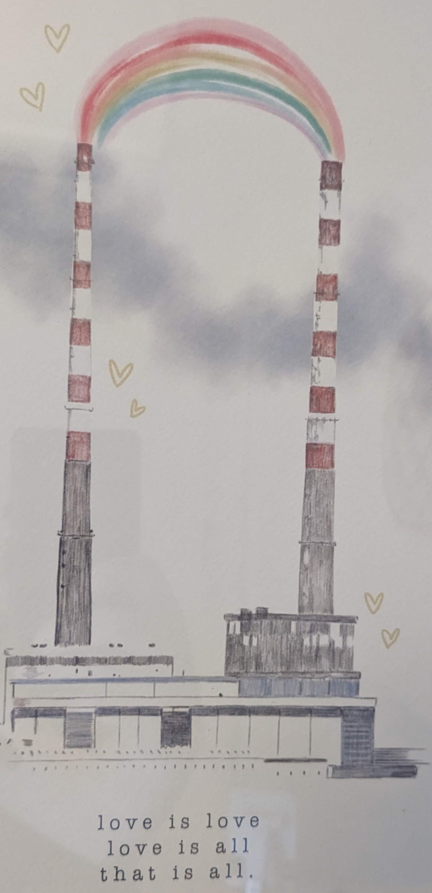

# BA Game Design Exam 1 2022

Rules:
- This test is about computational thinking using Processing
- You can use the [Processing reference](https://processing.org/reference/), any of the code examples or any of your own code examples as references
- No use of Google, chat-gpt3 etc etc and no collaboration 
- You have 2 hours
- Save your sketch often or backup to a git repo
- Refresh this page at 3pm to get a link to the submission system
- This test is *in person* unless by prior arrangement
- Anyone who has arranged in advance to take the test online should [join this teams meeting](https://teams.microsoft.com/l/meetup-join/19%3ameeting_YTFjYjY0OWEtMTBkYi00ZTlhLWJhZjAtMzY0ODJiMzA0YjQ0%40thread.v2/0?context=%7b%22Tid%22%3a%22766317cb-e948-4e5f-8cec-dabc8e2fd5da%22%2c%22Oid%22%3a%2261aab78b-a857-4647-9668-83d4cca5de03%22%7d)

This is the inspiration for the sketch you will be making today in the exam:

Draw the following elements in a Processing Sketch. 

- The two towers
- A representation of the base (Use your own creativity)
- Several birds that move back and forth
- The text
- The rainbow

Feel free to simplify the elements or use artistic license.

In your solution, consider the most efficient way to draw and animate the elements using the techniques you have learned on the course. Use loops, functions, arrays etc. etc.  

Marking scheme:

| Description | Marks |
| ------------|-------|
| Drawing the towers | 15 marks |
| Drawing the base | 15 marks |
| Birds | 30 marks |
| Text  | 10 marks |
| The rainbow | 20 marks |
| Any other cool thing | 10 marks |

